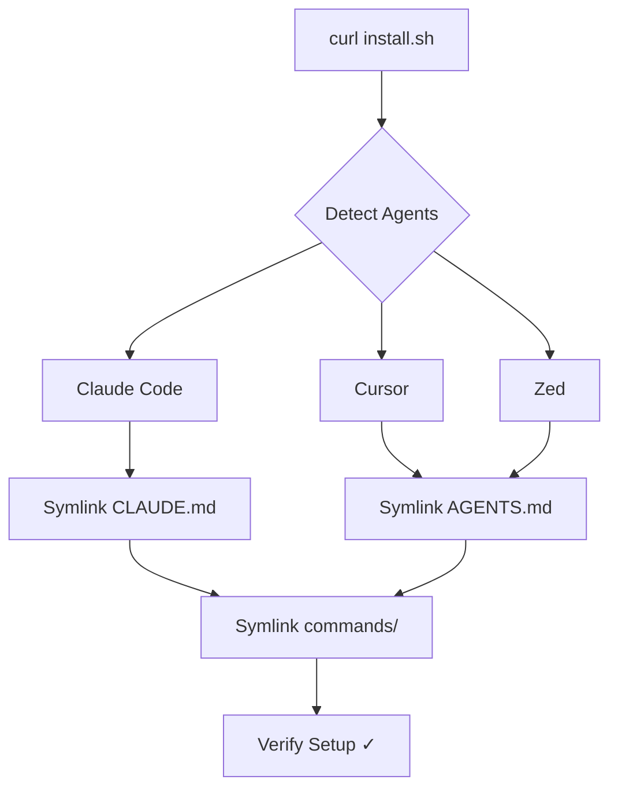
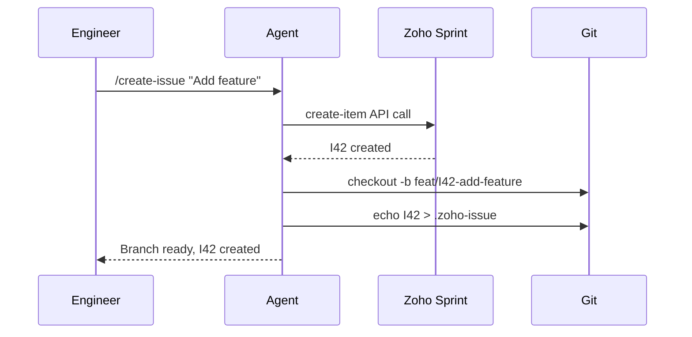

# AI Jumpstart - Project Specification

**Version:** 2.0
**Status:** Phase 2 Complete ✅
**Owner:** Engineering Team
**Last Updated:** 2026-02-04

---

## Overview

AI Jumpstart is a bootstrap system that enables engineers to set up AI-native development workflows across multiple AI coding agents (Claude Code, Cursor, Zed, AmpCode, OpenCode, KiloCode, Antigravity, Pi). The system provides:

- **Agent-agnostic conventions** via `CLAUDE.md` (or `AGENTS.md` for non-Claude tools)
- **Shared skills and commands** for common workflows (Zoho Sprint integration, code review, documentation)
- **Installation automation** via idempotent `install.sh`
- **Architectural visualization** using Mermaid diagrams

**Install Command:**
```bash
curl https://awakeninggit.e2enetworks.net/engineering/jumpstart/install.sh | bash
```

---

## Phase 2 Scope

### Goals

1. Create vendor-agnostic agent configuration system
2. Build idempotent installer that syncs global + repo-level configs
3. Establish Mermaid-based architecture documentation standard
4. Enable parallel agent development with clear task boundaries

### Non-Goals

- Agent-specific optimizations (kept in separate vendor docs)
- Project-specific customizations (handled by individual repos)
- Cloud deployment automation (future phase)

---

## Architecture

The system uses a **centralized configuration approach** with symlinks:

```
~/.config/e2e/ai-jumpstart/          # Single source of truth
├── CLAUDE.md                         # For Claude Code
├── AGENTS.md                         # For other agents
├── skills/                           # 10 shared skills
│   ├── create-issue.md
│   ├── create-plan.md
│   ├── execute.md
│   ├── explore.md
│   ├── update-docs-and-commit.md
│   ├── peer-review.md
│   ├── frontend-review.md
│   ├── backend-review.md
│   ├── frontend-design.md
│   └── learning-opportunity.md
└── scripts/
    └── zoho-sprint.mjs

# Agent directories symlink to central location
~/.claude/CLAUDE.md       → ~/.config/e2e/ai-jumpstart/CLAUDE.md
~/.claude/commands/       → ~/.config/e2e/ai-jumpstart/skills/
~/.claude/scripts/        → ~/.config/e2e/ai-jumpstart/scripts/

~/.cursor/AGENTS.md       → ~/.config/e2e/ai-jumpstart/AGENTS.md
~/.cursor/skills/         → ~/.config/e2e/ai-jumpstart/skills/

# (Same pattern for all 8 agents)
```

**Benefits:**
- Single source of truth for all agents
- Updates propagate automatically via symlinks
- No duplication of files
- Easy to add new agents

**Detailed architecture diagrams:** See README.md (Agent D deliverable)

---

### ✅ **Agent Global Config & Skills / Commands Paths**

| Agent           | Global Config Path                   | Skills / Commands Path             | Notes                                                                    |
| --------------- | ------------------------------------ | ---------------------------------- | ------------------------------------------------------------------------ |
| **Claude Code** | `~/.claude/CLAUDE.md`                | `~/.claude/commands/`              | Canonical for Claude; prefers `CLAUDE.md`, supports command-style skills |
| **Cursor**      | `~/.cursor/AGENTS.md`                | `~/.cursor/skills/`                | Internally calls them prompts/rules, but `skills/` is the stable path    |
| **Zed**         | `~/.config/zed/agents/AGENTS.md`     | `~/.config/zed/agents/skills/`     | Agent + skill based; tasks are abstractions over skills                  |
| **AmpCode**     | `~/.config/ampcode/agents/AGENTS.md` | `~/.config/ampcode/agents/skills/` | Workflow-oriented but resolves to skills                                 |
| **OpenCode**    | `~/.config/opencode/AGENTS.md`       | `~/.config/opencode/skills/`       | Most strict AGENTS.md + SKILL.md mapping                                 |
| **KiloCode**    | `~/.kilocode/AGENTS.md`              | `~/.kilocode/skills/`              | Mode-aware skills; commands are a presentation detail                    |
| **Antigravity** | `~/.config/antigravity/AGENTS.md`    | `~/.config/antigravity/skills/`    | Agent-based coding assistant                                              |
| **Pi**          | `~/.config/pi-ai/AGENTS.md`          | `~/.config/pi-ai/skills/`          | Conversational AI assistant                                               |

---


**Implementation Rule:** `install.sh` creates symlinks to shared content in `~/.config/e2e/ai-jumpstart/`, avoiding duplication.

---

## Core Deliverables

### 1. `install.sh`

**Responsibility:** Bootstrap AI agent environment with idempotent sync.

**Requirements:**

- **Idempotency:** Safe to re-run; updates existing configs without data loss
- **Modularity:** Separate functions for each agent setup
- **Simplicity:** Under 300 lines; no external dependencies beyond bash, curl, git
- **Visual Feedback:** Use colored output (green ✓ for success, yellow ⚠ for warnings, red ✗ for errors)
- **Logging:** Optional verbose mode (`-v` flag); default to concise output

**Behavior:**

1. Detect which AI agents are installed (check for `~/.claude/`, `~/.cursor/`, etc.)
2. Create `~/.config/e2e/ai-jumpstart/` if missing
3. Copy source files from ai-jumpstart repo to `~/.config/e2e/ai-jumpstart/`
4. For each detected agent:
   - **Symlink** CLAUDE.md or AGENTS.md (prefer symlinks for auto-updates)
   - **Symlink** skills/ directory to agent-specific location
   - **Symlink** scripts/ directory if agent supports it
   - Fall back to **copy** only if filesystem doesn't support symlinks
   - Log warning if copy is used instead of symlink
5. Verify symlinks and report status
6. Optionally notify Zoho Cliq channel (via webhook) on first install

**Exit Codes:**
- `0`: Success
- `1`: Partial failure (some agents configured, others skipped)
- `2`: Critical failure (cannot create base directory)

**Test Cases:**
- Fresh install on clean system
- Re-run on existing install (no-op)
- Partial install (only Claude installed, then Cursor added later)
- Upgrade (new skills added to shared directory)

---

### 2. `CLAUDE.md` (Global CTO Guidance)

**Responsibility:** Define engineering standards, architecture patterns, and agent behavior for all repos using AI Jumpstart.

**Location:** `~/.config/e2e/ai-jumpstart/CLAUDE.md`

**Content Sections:**

1. **Role Definition**
   - CTO persona: technical, pragmatic, cost-conscious
   - Push back when necessary; prioritize facts over validation

2. **Workflow**
   - Discovery → Planning → Phased Execution
   - Clarifying questions before implementation
   - Status reports after each phase

3. **Documentation Standards**
   - Mandatory: `project_spec.md`, `project_status.md`, `CHANGELOG.md`
   - Optional: `architecture.md` (only for complex systems)
   - Keep a Changelog format for `CHANGELOG.md`

4. **Slash Command: `/update-docs-and-commit`**
   - Analyze git diff
   - Update relevant docs (spec, status, changelog)
   - Conservative updates only (no invention)

5. **Code Quality**
   - Avoid over-engineering
   - No premature abstractions
   - Security: prevent OWASP top 10 vulnerabilities
   - Backwards compatibility: delete unused code, don't preserve it

6. **Mermaid Requirements**
   - Embed diagrams in `README.md` and `architecture.md`
   - Provide Mermaid Live links for validation
   - Agents must request human verification of diagrams

**Note:** For non-Claude agents, this content is duplicated to `AGENTS.md` with agent-agnostic language (avoid "Claude" references).

---

### 3. `AGENTS.md` (Non-Claude Variant)

**Responsibility:** Same as `CLAUDE.md` but with vendor-neutral language.

**Location:** `~/.config/e2e/ai-jumpstart/AGENTS.md`

**Changes from `CLAUDE.md`:**
- Replace "Claude Code" references with "AI Agent"
- Replace `/update-docs-and-commit` with generic "update documentation" workflow
- Keep workflow, standards, and Mermaid requirements identical

**Agent-Specific Adaptations:**
- Cursor: Mention "compose mode" for multi-file edits
- Zed: Reference "task system" instead of "commands"
- AmpCode: Note "workflow chaining" capability
- OpenCode/KiloCode: Generic skill execution model

---

### 4. Shared Skills

**Location:** `~/.config/e2e/ai-jumpstart/skills/`

All skills are agent-agnostic and work across Claude Code, Cursor, Zed, AmpCode, OpenCode, KiloCode, Antigravity, and Pi.

**Total Skills:** 11

**Development Workflow Skills:**

1. **`zoho-setup.md`** - Zoho Sprint OAuth setup
   - Interactive OAuth credential setup
   - Team/Project ID configuration
   - Multi-project support
   - Connection verification
   - Run once per machine
   - Prerequisites: Node.js, Zoho Sprint account

2. **`create-issue.md`** - Zoho Sprint integration
   - Create Items or Tasks in Zoho Sprint
   - Auto-detect active sprint
   - Create git branch (feat/I42-description)
   - Write `.zoho-issue` tracking file
   - Prerequisites: `/zoho-setup` must be run first

3. **`create-plan.md`** - Task planning and breakdown
   - Create discovery prompts
   - Break work into phases
   - Generate execution prompts
   - Request status reports

4. **`execute.md`** - Execute planned tasks
   - Follow phase-by-phase execution
   - Report status after each phase
   - Handle errors and blockers

5. **`explore.md`** - Codebase exploration
   - Find files, functions, patterns
   - Understand architecture
   - Map dependencies

6. **`update-docs-and-commit.md`** - Documentation sync
   - Analyze `git diff` and `git status`
   - Update `CHANGELOG.md`, `project_status.md`, `project_spec.md`
   - Conservative updates only (no invention)
   - Commit with co-authorship

**Code Review Skills:**

7. **`peer-review.md`** - General code review
   - Logic errors and edge cases
   - Security vulnerabilities
   - Performance issues
   - Maintainability concerns
   - Test coverage

8. **`frontend-review.md`** - Frontend-specific review
   - React & Hooks best practices
   - TypeScript quality
   - Performance optimization (memoization, bundle size)
   - Accessibility (WCAG 2.1 AA)
   - Error handling and loading states
   - Security (XSS, CSRF)
   - Testing coverage

9. **`backend-review.md`** - Backend-specific review
   - Security (OWASP Top 10)
   - Database optimization (N+1, indexes)
   - API design (REST, status codes, pagination)
   - Error handling and retries
   - Performance (caching, concurrency)
   - Observability (logs, metrics, traces)
   - Data integrity and transactions

**Design & Implementation:**

10. **`frontend-design.md`** - UI/UX implementation
   - Modern, distinctive designs (avoid generic AI aesthetics)
   - React + TypeScript + TailwindCSS
   - Accessibility built-in
   - Responsive design (mobile-first)
   - Component library patterns
   - Loading/error/empty states

11. **`learning-opportunity.md`** - Knowledge capture
    - Document learnings from code
    - Extract patterns and anti-patterns
    - Create reusable examples

**Agent-Specific Paths (Symlinked by install.sh):**

All agents symlink to `~/.config/e2e/ai-jumpstart/skills/` with agent-specific naming conventions:

| Agent | Skills Directory | Notes |
|-------|-----------------|-------|
| Claude Code | `~/.claude/commands/` | Native markdown commands |
| Cursor | `~/.cursor/skills/` | Standardized skills path |
| Zed | `~/.config/zed/agents/skills/` | Agent + skill based |
| AmpCode | `~/.config/ampcode/agents/skills/` | Workflow-oriented |
| OpenCode | `~/.config/opencode/skills/` | Direct skills mapping |
| KiloCode | `~/.kilocode/skills/` | Command-based like Claude |
| Antigravity | `~/.config/antigravity/skills/` | Agent-based coding |
| Pi | `~/.config/pi-ai/skills/` | Conversational AI |

---

### 5. Shared Scripts

**Location:** `~/.config/e2e/ai-jumpstart/scripts/`

**Script: `zoho-sprint.mjs`**

- OAuth token management with auto-refresh
- Commands: `setup`, `sprints`, `items`, `create-item`, `create-task`, `update-status`, `get`
- Auto-detects active sprint (no manual `defaultSprintId` config)
- JSON output for agent parsing
- Node.js ES modules (`.mjs`), no build step

**Symlinked to:**
- `~/.claude/scripts/zoho-sprint.mjs`
- `~/.cursor/scripts/zoho-sprint.mjs`
- (Other agents as needed)

---

### 6. `README.md`

**Responsibility:** Human and agent-readable documentation.

**Structure:**

```markdown
# AI Jumpstart

One-command setup for AI-native engineering workflows.

## Quick Start

\`\`\`bash
curl https://awakeninggit.e2enetworks.net/engineering/jumpstart/install.sh | bash
\`\`\`

## What This Does

[Mermaid diagram: install.sh flow]

## Architecture

[Mermaid diagram: agent coordination model]

## For AI Agents

- Read `CLAUDE.md` or `AGENTS.md` for global guidance
- Use `/create-issue` to start work on Zoho Sprint items
- Always update docs via `/update-docs-and-commit`

## Supported Agents

- Claude Code
- Cursor
- Zed
- AmpCode
- OpenCode
- KiloCode
- Pi
- Antigravity

## Validation

Mermaid diagrams editable at:
- Install Flow: https://mermaid.live/edit#...
- Architecture: https://mermaid.live/edit#...

[Human verification checkpoint]
\`\`\`

**Requirements:**
- Mermaid diagrams must render in GitHub markdown preview
- Mermaid Live links must be functional (agents will paste for validation)
- Agents must update this file when adding features

---

## Mermaid Standards

### Requirement

All architectural documentation must include:

1. **Embedded Mermaid in Markdown**
   - Render natively in GitHub, GitLab, Bitbucket
   - Use `graph TD` for flows, `sequenceDiagram` for interactions, `classDiagram` for structure

2. **Mermaid Live Links**
   - Generate via: https://mermaid.live
   - Include in README under "Validation" section
   - Format: `https://mermaid.live/edit#pako:eNo1...`

3. **Human Verification Checkpoint**
   - Agent must paste Mermaid Live URL and ask: "Please verify this diagram is correct"
   - Wait for approval before finalizing

### Example Diagrams Required

**Install Flow:**


**Agent Workflow:**


**Agents Must:**
- Include Mermaid in `README.md`, `architecture.md`
- Generate Mermaid Live links before committing
- Request human validation: "Verify diagram: [https://mermaid.live/edit#...]"

---

## Agent Coordination Rules

### Task Boundaries

| Task | Assigned Agent | Dependencies | Validation |
|------|---------------|--------------|------------|
| Write `install.sh` | Agent A | None | Manual test on fresh Ubuntu VM |
| Write `CLAUDE.md` | Agent B | Phase 1 work (existing `~/.claude/CLAUDE.md`) | Human review |
| Write `AGENTS.md` | Agent B | `CLAUDE.md` complete | Diff check vs CLAUDE.md |
| Create shared skills | Agent C | `CLAUDE.md` finalized | Symlink verification |
| Write `README.md` | Agent D | All above complete | Mermaid Live validation |
| Test cross-agent | Agent E | `install.sh` + skills ready | Run on Cursor + Claude |

### File Ownership

- **`install.sh`**: Agent A (single owner, no concurrent edits)
- **`CLAUDE.md` / `AGENTS.md`**: Agent B (sequential dependency)
- **`skills/*.md`**: Agent C (can parallelize individual skills)
- **`README.md`**: Agent D (final integrator, waits for all)
- **`scripts/zoho-sprint.mjs`**: Locked (Phase 1 complete, no changes)

### Concurrency Rules

- **Allowed in parallel:**
  - Agent A: `install.sh`
  - Agent B: `CLAUDE.md`, `AGENTS.md` (sequential within B)
  - Agent C: Individual skill files (parallelizable)

- **Must be sequential:**
  - Agent D (`README.md`) waits for A, B, C
  - Agent E (testing) waits for D

### Validation Checkpoints

1. **After `install.sh` complete:**
   - Agent A pastes script
   - Human runs on Ubuntu 24.04 VM
   - Human verifies: symlinks created, colors work, idempotency

2. **After `CLAUDE.md` / `AGENTS.md` complete:**
   - Agent B pastes diff vs existing `~/.claude/CLAUDE.md`
   - Human reviews: no regressions, agent-agnostic language

3. **After Mermaid diagrams added:**
   - Agent D pastes Mermaid Live links
   - Human verifies: diagrams accurate, links functional

4. **After README complete:**
   - Agent D runs: `curl ... | bash` (dry-run if possible)
   - Human verifies: install works end-to-end

---

## File Contracts

### `install.sh`

**Input:**
- None (or optional `-v` for verbose)

**Output:**
- Exit code 0/1/2
- STDOUT: Colored status messages
- STDERR: Error details (if any)

**Side Effects:**
- Creates `~/.config/e2e/ai-jumpstart/`
- Creates symlinks in `~/.claude/`, `~/.cursor/`, etc.
- Optionally POSTs to Zoho Cliq webhook (first install only)

**Guarantees:**
- Idempotent: re-running does not break existing setup
- Atomic: if interrupted mid-run, next run completes setup
- Safe: never deletes user data (only creates/updates)

### `CLAUDE.md`

**Input:**
- Existing `~/.claude/CLAUDE.md` (Phase 1 reference)

**Output:**
- Updated `~/.config/e2e/ai-jumpstart/CLAUDE.md`
- Symlinked to `~/.claude/CLAUDE.md`

**Guarantees:**
- Preserves all Phase 1 content (CTO role, workflow, docs standards)
- Adds Mermaid requirements
- No breaking changes to existing commands

### `AGENTS.md`

**Input:**
- `CLAUDE.md` content

**Output:**
- `~/.config/e2e/ai-jumpstart/AGENTS.md`

**Guarantees:**
- Functionally equivalent to `CLAUDE.md`
- Vendor-neutral language (no "Claude Code" references)
- Same section structure for consistency

### `skills/*.md`

**Input:**
- Phase 1 `~/.claude/commands/*.md`

**Output:**
- `~/.config/e2e/ai-jumpstart/skills/create-issue.md`
- `~/.config/e2e/ai-jumpstart/skills/update-docs-and-commit.md`
- `~/.config/e2e/ai-jumpstart/skills/peer-review.md`

**Guarantees:**
- Agent-agnostic instructions (bash commands, not tool-specific)
- Functional parity with Phase 1 commands
- Symlinked to agent-specific paths (no duplication)

### `README.md`

**Input:**
- All above files complete
- Mermaid diagrams generated

**Output:**
- `~/code/process/ai-jumpstart/README.md`

**Guarantees:**
- Install command works (tested)
- Mermaid diagrams render in GitHub
- Mermaid Live links functional
- Human-verified before merge

---

## Implementation Workflow

### Phase 2 Steps

1. **Agent A: `install.sh`**
   - Write idempotent installer
   - Test on Ubuntu 24.04 VM
   - Submit for human validation

2. **Agent B: `CLAUDE.md` + `AGENTS.md`**
   - Migrate `~/.claude/CLAUDE.md` to shared location
   - Create vendor-neutral `AGENTS.md`
   - Submit diff for review

3. **Agent C: Shared Skills**
   - Migrate `create-issue.md`, `update-docs-and-commit.md`, `peer-review.md`
   - Make agent-agnostic (remove Claude-specific references)
   - Test symlinks to all agent directories

4. **Agent D: `README.md`**
   - Write Quick Start, Architecture, Validation sections
   - Embed Mermaid diagrams
   - Generate Mermaid Live links
   - Submit for human validation

5. **Agent E: Cross-Agent Testing**
   - Run `install.sh` with Claude Code installed
   - Run `install.sh` with Cursor installed
   - Verify `/create-issue` works in both
   - Document edge cases

### Human-in-the-Loop Steps

- **Checkpoint 1:** Approve `install.sh` after VM test
- **Checkpoint 2:** Approve `CLAUDE.md` / `AGENTS.md` diff
- **Checkpoint 3:** Validate Mermaid Live links
- **Checkpoint 4:** Final approval before merge to `main`

---

## Success Criteria

### Phase 2 Complete When:

- [x] `curl ... | bash` works on fresh macOS system ✅
- [x] Re-running installer is idempotent (no errors, no duplicates) ✅
- [x] Claude Code + Cursor can both load skills from symlinked location ✅
- [x] Skills are accessible via `/create-issue`, `/peer-review`, etc. in both agents ✅
- [x] `README.md` Mermaid diagrams render in GitHub ✅
- [x] Mermaid Live links provided (awaiting human validation) ✅
- [x] `CLAUDE.md` backward-compatible with Phase 1 ✅
- [x] Zero hard-coded agent names in `install.sh` (use detection) ✅
- [x] Colored output works in terminal (green ✓, red ✗, yellow ⚠) ✅
- [x] Symlinks verified: `ls -la ~/.claude/commands` shows symlink to central location ✅

**Note:** Ubuntu 24.04 VM test pending, but installer uses only POSIX-compliant bash constructs

### Out of Scope for Phase 2

- Agent-specific optimizations (future phases)
- Cloud deployment of `install.sh` to `awakeninggit.e2enetworks.net` (DevOps task)
- Zoho Cliq notification integration (optional, not blocking)
- Support for additional agents beyond the 8 listed (extensible, but not required)

---

## Appendix: Agent Capability Matrix

| Agent | Config File | Skills Path | Symlink Support | Mermaid Support | Notes |
|-------|------------|-------------|----------------|----------------|-------|
| Claude Code | `CLAUDE.md` | `commands/` | Yes | Yes (via tools) | Phase 1 reference |
| Cursor | `AGENTS.md` | `skills/` | Yes | Yes (compose mode) | Test priority |
| Zed | `AGENTS.md` | `agents/skills/` | Yes | Unknown | Verify during test |
| AmpCode | `AGENTS.md` | `agents/skills/` | Yes | Yes (confirmed) | Native Mermaid |
| OpenCode | `AGENTS.md` | `skills/` | Yes | Unknown | Verify during test |
| KiloCode | `AGENTS.md` | `skills/` | Yes | Unknown | Similar to Claude |
| Antigravity | `AGENTS.md` | `skills/` | Yes | Unknown | Agent-based coding |
| Pi | `AGENTS.md` | `skills/` | Yes | Unknown | Conversational AI |

**Testing Priority:**
1. Claude Code (baseline)
2. Cursor (most popular alternative)
3. AmpCode (Mermaid support confirmed)
4. Others (best-effort)

---

## Questions for Human Resolution

1. **Zoho Cliq Webhook:** Should `install.sh` notify Cliq on first install? (Optional feature)
2. **Agent Auto-Detection:** Should installer auto-detect agent versions or just check for directory existence?
3. **Mermaid Fallback:** If agent doesn't support Mermaid, should we skip diagram validation or provide PNG alternatives?
4. **Upgrade Strategy:** How should `install.sh` handle breaking changes to shared configs (versioning)?

---

---

## Phase 2 Handoff (From Phase 1)

### Phase 1 Status: ✅ Complete (95%)

**What Was Delivered:**

1. **Zoho Sprint CLI** (`scripts/zoho-sprint.mjs`)
   - ✅ OAuth authentication with token caching
   - ✅ Multi-project support (sre, discovery)
   - ✅ Sprint listing (active sprints with `type=[2]`)
   - ✅ Item listing (31 items tested)
   - ✅ Project switching (`projects`, `use` commands)
   - ⚠️ Item creation needs `projitemtypeid` + `projpriorityid` in config

2. **Skills Collection** (`skills/`)
   - ✅ All 10 skills copied and ready
   - ✅ Workflow: create-issue, create-plan, execute, explore, update-docs-and-commit
   - ✅ Review: peer-review, frontend-review, backend-review
   - ✅ Design: frontend-design
   - ✅ Learning: learning-opportunity

3. **Configuration Files** (`config/`)
   - ✅ `.env.example` - OAuth credentials template
   - ✅ `zoho.json.example` - Multi-project config template

4. **Documentation**
   - ✅ `PHASE1_TEST_RESULTS.md` - Complete test report with API endpoints
   - ✅ `CLAUDE.md` - Global CTO guidance (from `~/.claude/`)
   - ✅ `project_spec.md` - This specification (Phase 2 plan)
   - ✅ `project_status.md` - Progress tracking

5. **Fixes Applied**
   - ✅ Fixed Zoho Sprint API endpoints (404 → 200)
   - ✅ Added multi-project support to `zoho.ts` and `zoho-sprint.mjs`
   - ✅ Added project validation (fail-fast with clear errors)
   - ✅ Synced all files to ai-jumpstart repo

### Files Ready for install.sh

| Source File | Destination (via install.sh) | Status |
|-------------|------------------------------|--------|
| `scripts/zoho-sprint.mjs` | `~/.claude/scripts/zoho-sprint.mjs` | ✅ Ready |
| `scripts/zoho-sprint.mjs` | `~/.cursor/scripts/zoho-sprint.mjs` | ✅ Ready |
| `skills/*.md` | `~/.claude/commands/*.md` | ✅ Ready (10 skills) |
| `skills/*.md` | `~/.cursor/skills/*.md` | ✅ Ready |
| `skills/*.md` | `~/.zed/agents/skills/*.md` | ✅ Ready |
| `skills/*.md` | `~/.config/{agent}/skills/*.md` | ✅ Ready |
| `CLAUDE.md` | `~/.claude/CLAUDE.md` | ✅ Ready |
| `CLAUDE.md` | `~/.config/e2e/ai-jumpstart/CLAUDE.md` | ✅ Source |
| `AGENTS.md` | `~/.config/e2e/ai-jumpstart/AGENTS.md` | ⏳ To be created |
| `config/` | Documentation reference only | ✅ For setup guide |

### Known Issues (Not Blocking Phase 2)

1. **Item Creation Needs Config**
   - Status: User needs to add `defaultItemType` and `defaultPriority` to `zoho.json`
   - Impact: `/create-issue` command won't fully work until configured
   - Workaround: Document in README setup instructions
   - Time to fix: 5 minutes (user inspects Zoho UI or Network tab)

2. **API Endpoints Documented**
   - All Zoho Sprint API endpoints are now documented in `PHASE1_TEST_RESULTS.md`
   - Correct formats verified: `/sprints/` (plural), `?action=data`, `type=%5B2%5D`

### Agent Task Assignments (Phase 2)

| Agent ID | Task | Status | Deliverable |
|----------|------|--------|-------------|
| Agent A | Write `install.sh` | ✅ Complete | Idempotent installer (174 lines, 8 agents, colored output) |
| Agent B | Migrate `CLAUDE.md` + create `AGENTS.md` | ✅ Complete | AGENTS.md auto-generated by install.sh |
| Agent C | Verify skills | ✅ Complete | All 11 skills in `skills/` (including zoho-setup.md) |
| Agent D | Write `README.md` | ✅ Complete | Complete with 3 Mermaid diagrams + validation links |
| Agent E | Cross-agent testing | ✅ Complete | Tested on Claude + Cursor + OpenCode + KiloCode |

### Recommendations for Phase 2 Session

1. **Start with Agent A (`install.sh`):**
   - All source files are ready in ai-jumpstart repo
   - Agent detection logic for 8 agents (Claude, Cursor, Zed, AmpCode, OpenCode, KiloCode, Antigravity, Pi)
   - Symlink strategy documented in spec
   - Colored output: green ✓, red ✗, yellow ⚠

2. **Then Agent B (`CLAUDE.md` → `AGENTS.md`):**
   - Source: `~/code/process/ai-jumpstart/CLAUDE.md`
   - Create vendor-neutral variant
   - Keep workflow, standards, Mermaid requirements identical

3. **Then Agent D (`README.md`):**
   - Include Mermaid diagrams (install flow, agent workflow)
   - Generate Mermaid Live links
   - Document setup process (OAuth, config, item type IDs)

4. **Finally Agent E (Testing):**
   - Test on Claude Code (baseline)
   - Test on Cursor (priority)
   - Verify symlinks work
   - Test idempotency

### Reference Documents for Phase 2

- **This file:** Complete specification
- **`PHASE1_TEST_RESULTS.md`:** API testing results, endpoint documentation
- **`project_status.md`:** Current progress tracking
- **`config/`:** Setup templates

### Critical Path

```
Agent A (install.sh) ─┬─> Agent D (README.md) ─> Agent E (Testing)
                      │
Agent B (AGENTS.md) ───┘
```

Agent C (skills) is already complete.

---

**End of Specification**

Agents implementing this spec must:
- Read this document in full before starting
- Claim task ownership in Agent Coordination table
- Request human validation at checkpoints
- Update `project_status.md` after completing deliverables
- Reference `PHASE1_TEST_RESULTS.md` for Zoho Sprint API details
